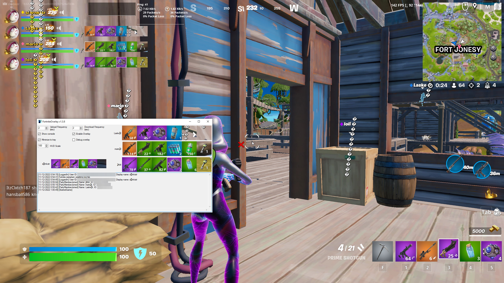

# FortniteOverlay



Gear overlay for Fortnite. Automatically gets current squad as you play and overlays a screenshot of their gear in the top-left corner if they're also running it.

Designed for 100% HUD scale at 1080p or 1440p. Other resolutions and scales are calculated from these and may not be accurate.

Downloads ~5MB/hr per squadmate and uploads ~5MB/hr. Doesn't download or upload unless Fortnite is open and you're in a party with other players.

## Config

Config file is %LOCALAPPDATA%/FortniteOverlay/config.json and will be created on first launch if it doesn't already exist.

Secret key, upload endpoint, and image location need to be provided by someone with a server; see [Server Setup](#server-setup) to host.

## Server Setup

Server uses NGINX autoindexing and a [modified ShareX uploader (included as upload.php)](upload.php) to send and receive images.

Make sure to change the secret key.

Example NGINX config:

```
server {
    listen 443 ssl;
    server_name example.com;

    root /var/www/example.com;
    index index.html index.htm index.php;
    location / {
        try_files $uri $uri/ =404;
    }

    location /fortnitegear {
        location ~ \.php$ {
            include snippets/fastcgi-php.conf;
            fastcgi_pass unix:/run/php/php7.4-fpm.sock;
        }

        location ~ /images {
            autoindex on;
            autoindex_format json;
        }
    }
}
```

Folder structure:

```
var
└─ www
   └─ example.com
      ├─ ...
      └─ fortnitegear
         ├─ upload.php
         └─ images
            └─ ...
```